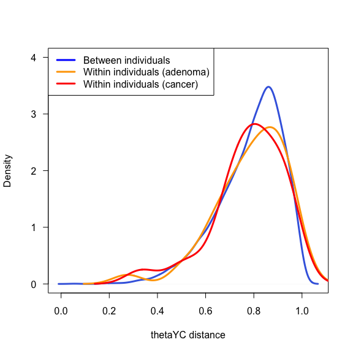
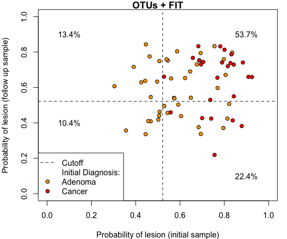
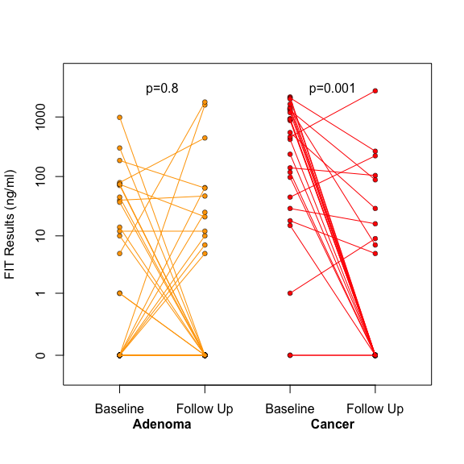
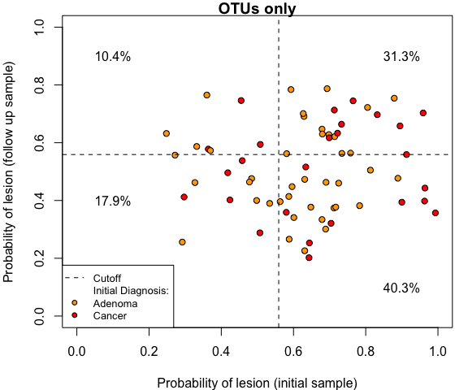
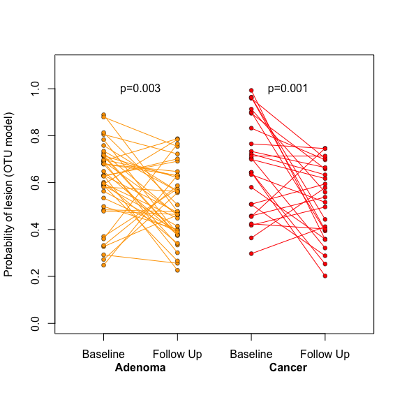
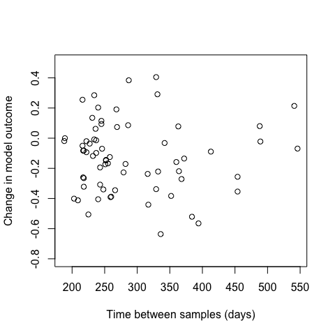

# Follow-up Samples
Niel  
November 20, 2015  





**Figure 1. Inter- vs Intra-personal Beta Diversity**  
The first thing I tested was whether the microbiomes of patients were more similar to themselves over time than to others. Surprisingly, there was no difference between intra- and interindividual thetaYC distances. Distances within cancer patients seems to be slightly less than within adenomas, but the difference isn't significant.  There's no difference when splitting interindividual distances by diagnosis. There's also no difference when comparing distances between initial samples to distances between followups.




**Figure 2A. Combined Model (FIT + OTUs) applied to initial and follow up samples.**  
Next, I generated a random forest model for distinguishing normal from lesion using all of the initial samples that didn't have follow ups (n=422). The optimal model used 46 OTUs and FIT. I then applied the model to the other initial samples and their follow ups. The scatter plot below shows how the model classified each individual's initial and follow up samples (n=67). The model detected 26 of 26 cancers and 22 of 41 adenomas in the initial samples. Of the 48 individuals who tested positive with the initial sample, 29 remained positive with the follow up sample. 10.4% of individuls were negative for both the initial and followups (all adenomas). Surprisingly, 13.4% of individuals were negative at the initial sampling, but became positive at the follow up.



**Figure 2B.** This next figure shows the change in FIT result from the initial to the follow up samples. For the adenomas, it's fairly random. Some go from positive to negative, but just as many go form negative to positive. For the cancers, however, a large portion of them go from high FIT results to zero, while none of them go from zero to higher results. As a result, there is a significant reduction in FIT results for cancers, but not for adenomas. 


```
## quartz_off_screen 
##                 2
```

**Figure 2C.** This next figure shows how the model results changed over time. Based on the previous figure, you'd expect outcome of the model to change more for the cancer samples than for the adenomas. Indeed, there is a significant reduction in the probability of lesion for the cancers but not the adenomas. This is most likely due to the reduction in FIT results indiviuduals that had cancers.




**Figure 3A. Otucome of Microbiome model (no FIT) on the initial and followup samples.** I did the same thing as figure 2, but left out the FIT results from the model. In this case the optimal used only 79 OTUs, yet it detected lesions nearly as well as the combined model. It detected detected 19 of 26 cancers (worse than the combined model) and 22 of 41 adenomas (better than the combined model) in the initial samples. Of the 41 initial samples that tested positive, 14 remained positive. In summary, compared to the combined model, the microbiome only model was better at detected adenomas, worse at detecting cancers, and individuals were more likely to appear to "normal" at the follow up.



**Figure 3B.** Unlike the combined model, there was significant reducation in probability of lesion for both patients with adenomas and those with cancer when using the microbiome only model.




**Figure 4.** I thought perhaps a longer time between sampling would increase the likelihood that an individual would appear "normal". However, there was no correlation between the change in model outcome and the time between samples. 


**Figure 5.** I compared the abundance of the four main cancer-associated OTUs over time. There was a significant decrease in the abundance of these OTUs for patients with carcinomas, but for patients with adenomas.

